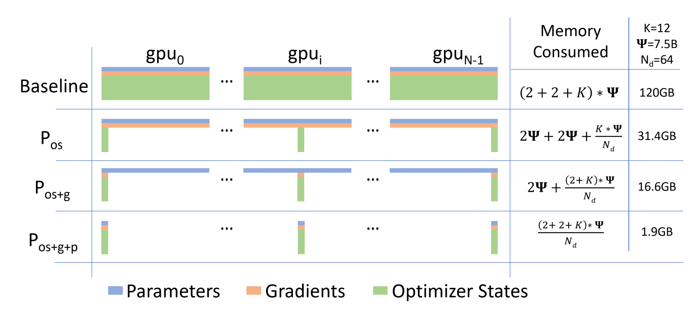
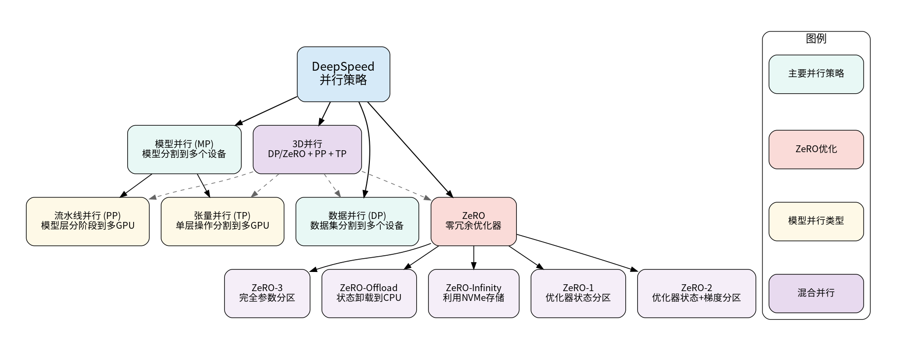
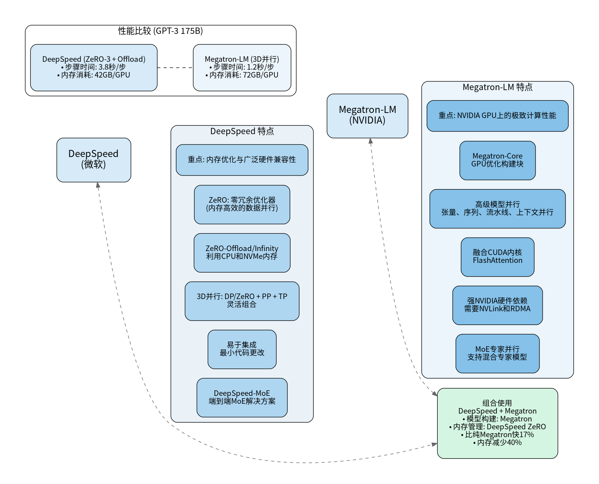
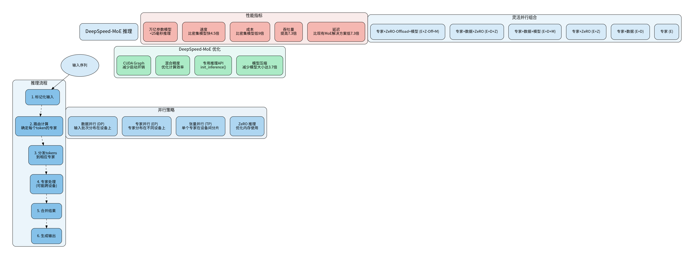

# DeepSpeed 和 Megatron

## Resource

- [图解大模型训练系列之：DeepSpeed-Megatron MoE并行训练（原理篇）](https://zhuanlan.zhihu.com/p/681154742)

## DeepSpeed (Microsoft)

关键技术和核心组件:

- **ZeRO (Zero Redundancy Optimizer)**: 将模型状态（优化器状态、梯度和参数）分区到多个 GPU 上，显著减少内存使用量
  - **ZeRO-1**: 对优化器状态进行分区
  - **ZeRO-2**: 对优化器状态和梯度进行分区
  - **ZeRO-3**: 完全分区所有模型状态，包括参数，提供最大的内存优化
    
  - **ZeRO-Offload** 和 **ZeRO-Infinity**: 基于 ZeRO 的异构内存技术，利用 CPU 和 NVMe 内存，使得在有限的 GPU 资源上微调大型模型成为可能。ZeRO-Offload 专门将优化器状态和梯度卸载到 CPU 内存。
- **3D 并行**: DP + TP + PP
    

## Megatron (Nvidia)

Megatron-LM 和 Megatron-Core 的关键组件和特点包括：
- **GPU 优化构建块**：所有构建块和功能都经过 GPU 优化，以在 NVIDIA 加速计算基础设施上获得最佳训练速度和稳定性。
- **高级模型并行**：包括张量、序列、流水线、上下文和 MoE 专家并行等技术。
- **高效数据加载器**：具有高效的数据加载器，在训练前对数据进行标记化和洗牌，并存储索引序列以避免重新计算。
- **融合 CUDA 内核**：利用融合 CUDA 内核，如 Apex 的 AdamW 实现，通过将类似操作合并为单个硬件操作，减少内存移动，从而加快操作速度。
- **分布式优化器和激活检查点**：内置的分布式优化器和激活重计算功能确保高效和稳定的训练。
- **FlashAttention**：一种高效的注意力机制实现，显著加快训练速度。
- **多模态训练支持**：最新版本增加了对多模态训练的支持。

## DeepSpeed 和 Megatron 对比

**DeepSpeed 优势**
- 内存优化：ZeRO 技术分区模型状态，大幅减少内存占用
- 广泛硬件兼容性：支持 CPU、GPU、NPU 和 NVMe，兼容 AMD、NVIDIA 和 Ascend 平台
- 易于集成：通常只需最小的代码更改即可整合到现有 PyTorch 训练脚本中
- 灵活并行组合：3D 并行结合多种并行策略，提供灵活配置
- ZeRO-Offload/Infinity：利用 CPU 和 NVMe 内存扩展训练能力

**Megatron 优势**
- 极致计算性能：在 NVIDIA GPU 集群上实现卓越性能
- Megatron-Core：高度优化的 GPU 构建块，提供正式产品支持
- 高级模型并行：支持张量、序列、流水线、上下文并行
- 融合 CUDA 内核：如 FlashAttention，显著提升性能
- 专为 Transformer：特别适合基于 Transformer 的 NLP 架构

**对比**
- **主要关注点**：Megatron-LM 主要设计用于 NVIDIA GPU 集群上的极端计算性能，特别是基于 Transformer 的 NLP 架构。DeepSpeed 由微软开发，是一个更通用的 PyTorch 优化库，优先考虑内存优化和跨各种硬件的可扩展性。
- **内存优化**：DeepSpeed 的 ZeRO 是一种核心内存优化技术，它分区模型状态以减少内存占用。虽然 Megatron 也包括激活检查点等内存优化，但 ZeRO 是 DeepSpeed 的一个独特和核心特性。
- **易用性/集成**：DeepSpeed 通常被认为更容易集成到现有的 PyTorch 训练脚本中，通常只需要最小的代码更改。Megatron 由于其特定的设计模式和强硬件依赖性，可能需要更显著的代码重构。
- **性能（GPT-3 175B 示例）**：在 GPT-3 175B 训练的比较中，具有 3D 并行的 Megatron-LM 实现了更快的单步时间（1.2 秒/步）和在 NVIDIA 集群上非常低的通信开销。具有 ZeRO-3 + Offload 的 DeepSpeed 单步时间较慢（3.8 秒/步），但展示了更低的每 GPU 内存消耗（42GB/GPU，相比 Megatron 的 72GB/GPU）。
- **硬件依赖**：Megatron 对 NVIDIA GPU 有很强的依赖性，通常需要 NVLink 和高速 RDMA 以获得最佳性能。DeepSpeed 提供了跨各种硬件的更广泛兼容性，包括 CPU、GPU、NPU 和 NVMe，并支持 AMD、NVIDIA 和 Ascend 平台。
- **组合使用**：DeepSpeed 和 Megatron-LM 可以组合使用，以利用它们各自的优势。例如，使用 Megatron 进行模型构建和 DeepSpeed 的 ZeRO Optimizer 进行内存管理可以带来显著的性能提升和内存减少，比如在 512 张 A100 卡上训练 GPT-4 比纯 Megatron 快 17%，内存少 40%。

## DeepSpeed 与 Megatron 框架中的 MoE 模型推理

- **DeepSpeed-MoE**

  - DeepSpeed MoE 支持五种不同形式的并行，并利用 GPU 和 CPU 内存。其灵活的设计允许用户混合各种流行的并行技术，包括专家（E）、专家 + 数据（E+D）、专家 + ZeRO 驱动的数据（E+Z）、专家 + 数据 + 模型（E+D+M）、专家 + 数据 + ZeRO 驱动的数据（E+D+Z）和专家 + ZeRO-Offload + 模型（E+Z-Off+M）。

- **Megatron MoE**
  - Megatron-Core 库包括高级模型并行技术，特别提到 MoE 专家并行。Megatron-LM 也支持 MoE 模型。

- **对比**
  - **DeepSpeed-MoE**
    - 端到端解决方案：专为 MoE 训练和推理设计
    - 模型压缩：可将 MoE 模型大小减少多达 3.7 倍
  - **Megatron MoE**
    - 支持 MoE 专家并行作为核心功能
    - 在 NVIDIA 集群上提供极致计算性能